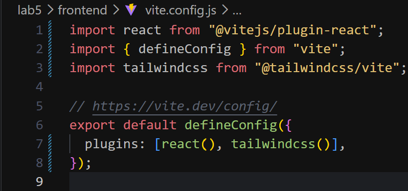

#Project Setup

1. create two folder frontend and backend

2. go to frontend `cd frontend`
   - type `npm create vite@latest`
   - press `y` if asked to install
   - enter `.` in project name
   - select `React` as framework from arrow key
   - select Javascript nfrom variant by arrow key
   - select ESLint ny arrow key
   - select Yes and press enter

3. Setup tailwind in React Porject
   - install by `npm install tailwindcss @tailwindcss/vite`
   - open `vite.config.js` and add import tailwindcss from '@tailwindcss/vite'`also in plugins - `tailwindcss()`
     
    - add `@import "tailwindcss"` on top of index.css
    
